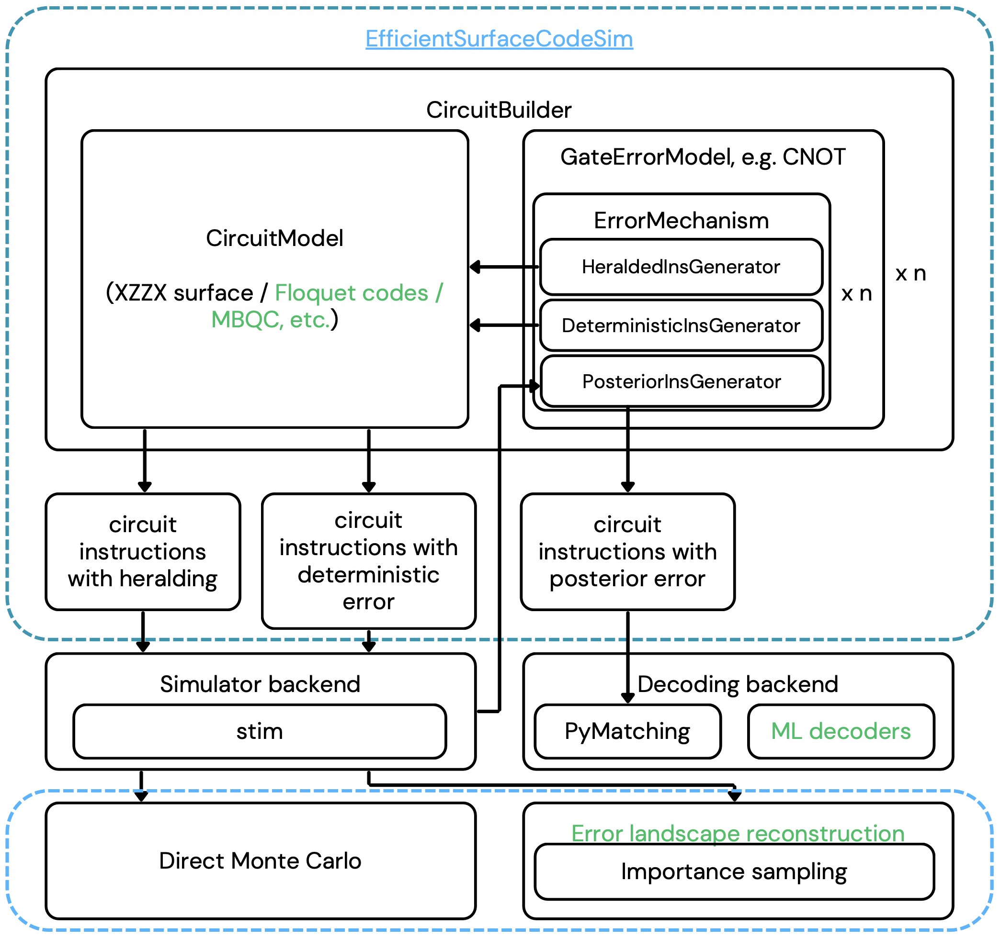

# EfficientSurfaceCodeSim

```
pip3 install git+https://github.com/JiakaiW/EfficientSurfaceCodeSim
```


(The blue dashed lines encircle the scope of this package. Features written in green haven't been implemented yet.) 

## Why another package?

1. The execellent package [Stim](https://github.com/quantumlib/Stim) provides the backend for efficient Pauli frame simulation and stim's instructions provide flexible ways to describe common error models. However, the simulation-decoding workflow for more flexible errors models like erasure still require careful thoughts. 

2. At low physical error rates, direct Monte Carlo sampling becomes prohibative, and importance sampling is required to probe at the important region, this requires injecting fixed amount of error at random locations.

## How it works.
1. Noise models are abstracted into GateErrorModel, and different InstructionGenerators uses **vectorized bitwise logic** to yield instructions in batch. The bitwise logic enables decoding erasure conversion (limited to perfect erasure checks), and injecting deterministic errors for importance sampling.

### Details of ErrorModel
1. A GateErrorModel contains one or more ErrorMechanisms that are independent.
2. An ErrorMechanism contains multiple InstructionGenerators that tells the ErrorMechanism how to inject stim instructions in different circuit generation modes (generating erasure circuit to be sampled, or generating circuits with posterior probabilities given erasure check results, or circuits with deterministic errors for importance sampling).
3. InstructionGenerators uses abstraction like MQE (Multi Qubit Error/Event) and SQE (Single Qubit Error/Event) to calculate the posterior probability given an array erasure detection.

### Direct Monte-Carlo usage with distributed computing (I used HTCondor):
1. Use Docker to build a container and store in DockerHub [(link to repo)](https://hub.docker.com/r/jiakaiw/surfacesimulationtest/tags).
2. Generate decoding problem instances [(job class)](EfficientSurfaceCodeSim/job.py)) and send those instances to distributed computing
3. Gather those decoding results in form of JSON files
4. Data analytics on my local computer

### Importance sampling usage (injecting fixed number of errors in random locations):
1. Use "deterministic" mode when generating the circuit, and decode as usual. (call decode_by_generating_new_circuit if erasure conversion is involved.)
2. [(link to demo of importance sampling and decoding)](notebooks/usage_demo.ipynb)
3. The capability to deterministically inject error allows future extension of this pacakage to simulate undetected leakage (without needing to use stim.TableauSimulator)
